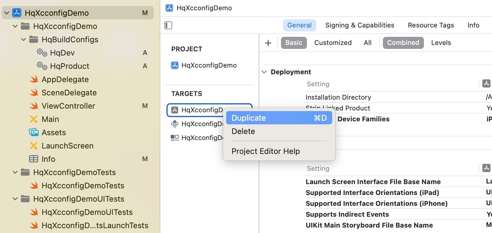
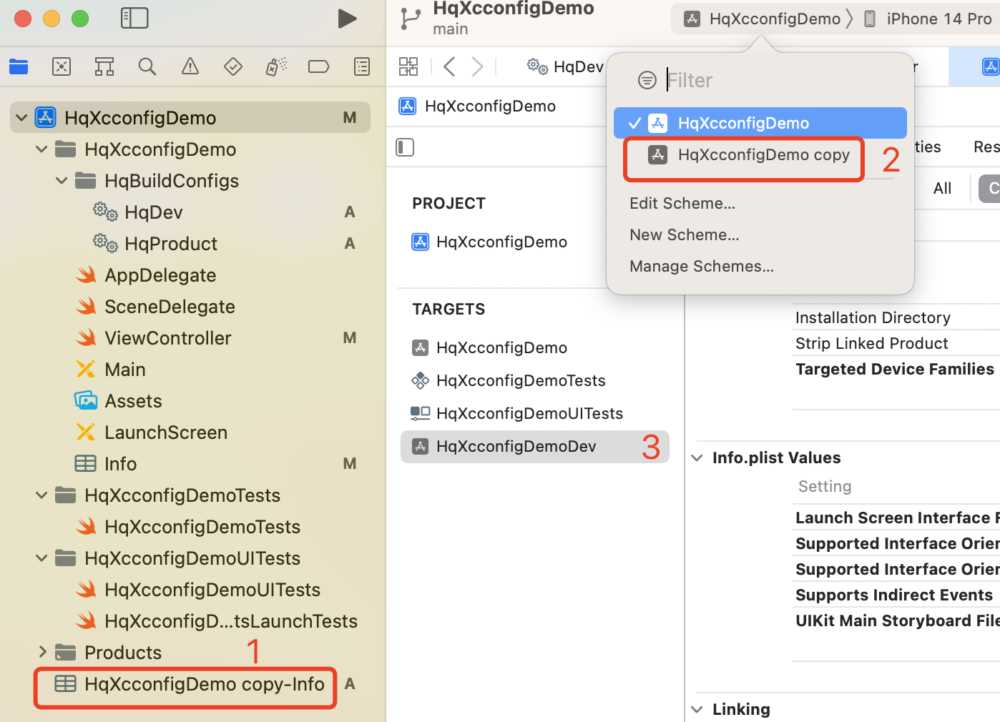
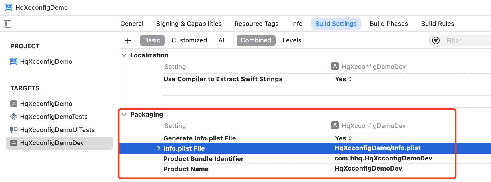
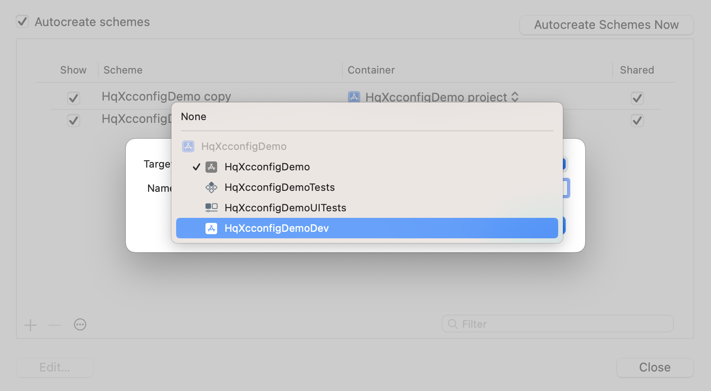
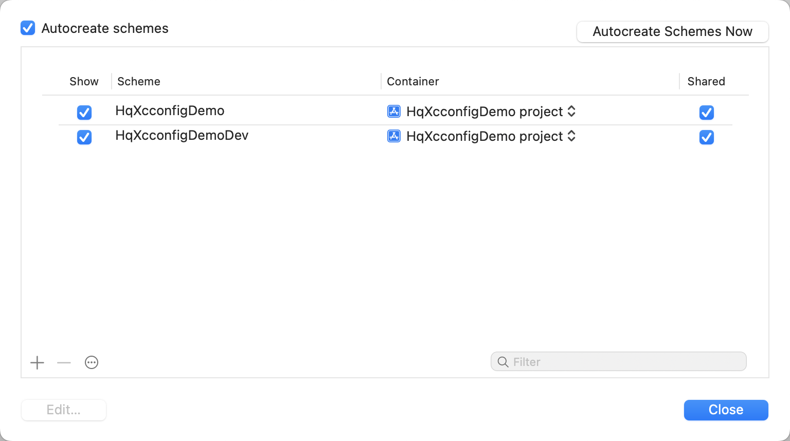
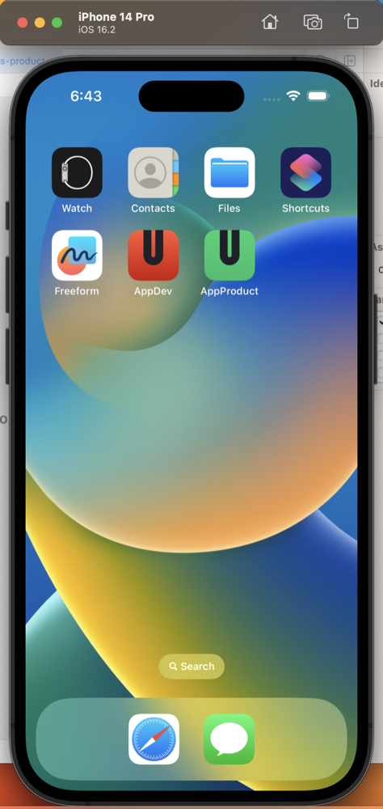

[toc]
# 给项目创建不同编译配置文件
## 创建 `Configuration Settings File (xcconfig)` 文件


## 在不同的`xcconfig`文件创建编译变量
通过上面的步骤创建`HqDev.xcconfig`和`HqProduct.xcconfig` 配置文件，其内容如下

`HqDev.xcconfig` 文件配置如下
```
APP_TARGET_TYPE = dev
API_PROTOCAL = http
API_HOST = 127.0.0.1:8000

```

`HqProduct.xcconfig` 文件配置如下
```
APP_TARGET_TYPE = dev
API_PROTOCAL = http
API_HOST = 127.0.0.1:8000

```


## 在`PROJECT`的`Configurations`对不同的target配置我们上面创建的`xcconfig`文件
通过选择  `PROJECT->info->Configurations` 分别为`Debug`和`Release`模式下不同的`target`选择我们刚才创建的配置文件


选择结果如下


## 查看配置的变量是否生效
通过选择 `TARGETS->HqxcconfigDemo->Build Settings->User-Defined`查看我们配置的结果如下图


## 在`info.pist`文件中使用配置的变量
在`info.plist`文件中使用我们定义的变量添加键值对,键值使用我们配置中定义变量的可以使用`$(var_name)`或`${var_name}`
如下图


## 在代码中读取`info.plist`配置的api信息
`ViewController`的代码如下：
```swift
class ViewController: UIViewController {
    
    lazy var apiInfoLab: UILabel = {
        let lab = UILabel.init()
        lab.font = UIFont.systemFont(ofSize: 20)
        lab.textColor = UIColor.purple
        lab.frame = self.view.frame
        lab.textAlignment = .center
        lab.numberOfLines = 0
        return lab
    }()
    
    func apiInfo() -> String {
        //获取info.plist配置的api信息
        let api_protocal = Bundle.main.infoDictionary?["API_PROTOCAL"] as? String ?? ""
        let api_host = Bundle.main.infoDictionary?["API_HOST"] as? String ?? ""
        print(api_protocal,api_host,target_type)
        return api_protocal + "://" + api_host
    }

    override func viewDidLoad() {
        super.viewDidLoad()
        self.view.addSubview(self.apiInfoLab)
        self.apiInfoLab.text = self.apiInfo()
    }
}

```

## 切换不同的模式查看结果
通过 `菜单栏->Product->Scheme->Edit Scheme->Run->Info->Configuration`选择`Debug`或`Release`来运行项目，结果如下图


# 为项目创建不同的Target

## 在已有target中复制一个新的
在已有target选中右击如下图

将复制的target名称按`Enter`键即可修改为`HqXcconfigDemoDev`结果如下



## 为复制的Traget配置info.plist文件
选中复制的`HqXcconfigDemoDev`target
通过 `Build Settings->Packaging->info.plist File`将其值改为默认的`HqXcconfigDemo/info.plist`,
这样两个target就可以共用一个`info.plist`了
此时可以删除刚才复制target时产生的`HqXcconfigDemo copy-info.plist`文件了


## 修改`HqXcconfigDemo copy`scheme的名称为`HqXcconfigDemoDev`
* 首先新建一个scheme
通过 `菜单栏->Product->Scheme->Manager Schemes`点击左下的`+`按钮新建scheme，在`Name`输入框输入`HqXcconfigDemoDev`，`Target`下拉列表中选择我们复制修改名称后的`HqXcconfigDemoDev`target，如下图所示

* 删除`HqXcconfigDemo copy`scheme
选中`HqXcconfigDemo copy`scheme，然后点击左下的`-`删除即可，结果如下

此时我们的复制的target名称和shceme的名称就保持一致了，然后我们就可以切换不同的scheme来运行对应的target了

## 为我们的target配置不同的名称，Bundle ID
* 首先配置`HqXcconfigDemo`target,
通过`TARGTS->HqXcconfigDemo->General->Identity`,为其配置`Display name`为`AppProduct`,`Bundle Identifer`为`com.hhq.HqXcconfigDemo`

* 再配置`HqXcconfigDemo`target,
通过`TARGTS->HqXcconfigDemoDev->General->Identity`,为其配置`Display name`为`AppDev`,`Bundle Identifer`为`com.hhq.HqXcconfigDemoDev`
以上名称和ID自己根据实际定义,此时我们切换不同的scheme就会运行两个应用了

## 为不同target配置应用图标

1. 同过 `File->New->File->Assets Catalog`分别新建两个资源文件`Assets-dev`和`Assets-product`新建时`Assets-dev`的Targets勾选`HqXcconfigDemoDev`,`Assets-product`的Targets勾选`HqXcconfigDemo`
2. 分别上面在新建的资源文件右击选择
`iOS->New iOS App Icon`,然后删除掉默认资源文件`Assets`中的的`AppIcon`
3. 分别找到一个1024*1204 pt的的png图标做为两个Target的应用图标
4. 选择不同scheme来运行查看
结果如下：



## 区分代码中不同的target
依然是通过编译配置文件的环境变量来区分即可


