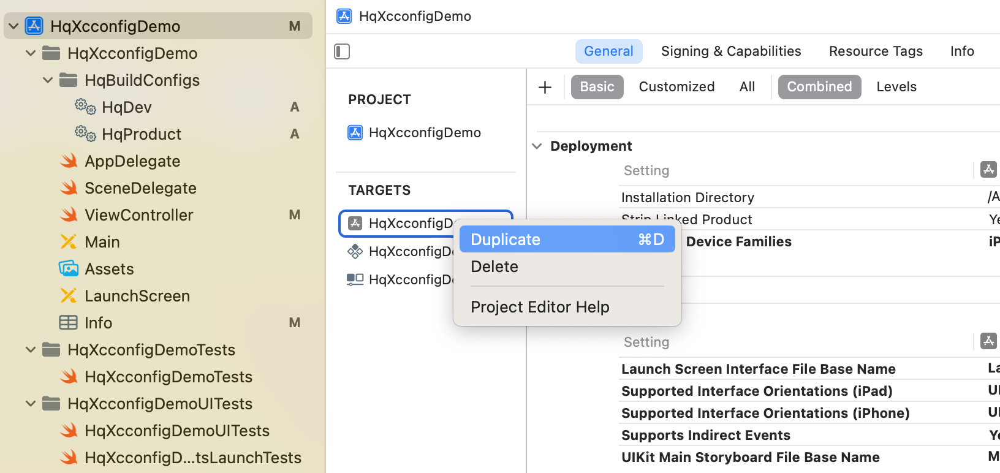
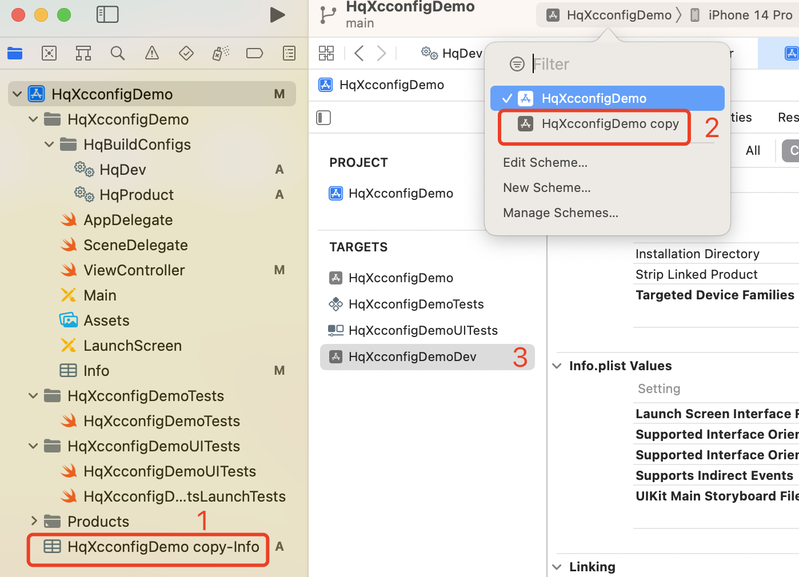
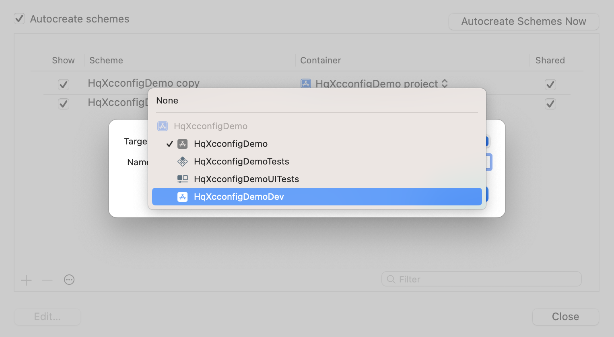
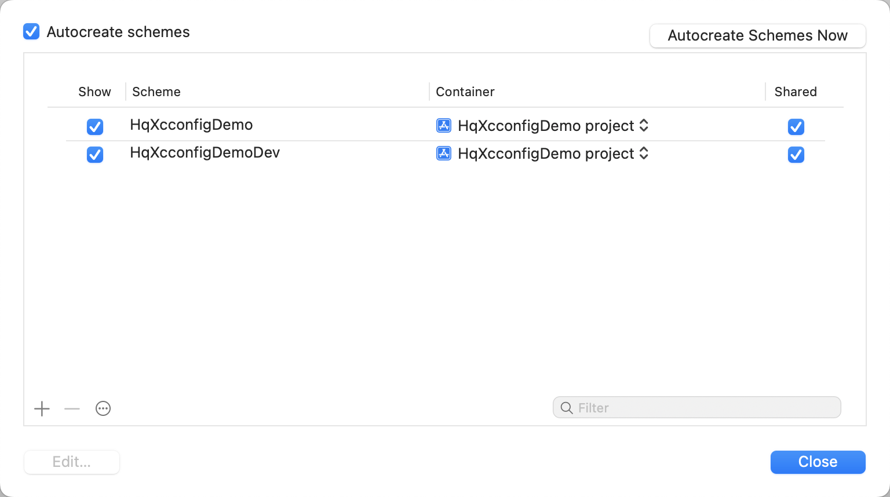
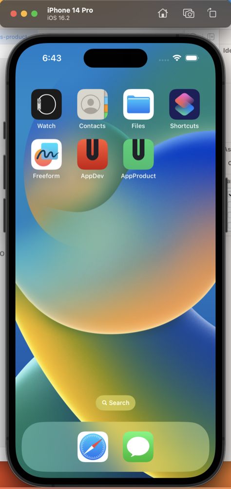

# 为项目创建不同的Target

## 在已有target中复制一个新的
在已有target选中右击如下图

将复制的target名称按`Enter`键即可修改为`HqXcconfigDemoDev`结果如下

## 为复制的Traget配置info.plist文件
选中复制的`HqXcconfigDemoDev`target
通过 `Build Settings->Packaging->info.plist File`将其值改为默认的`HqXcconfigDemo/info.plist`,
这样两个target就可以共用一个`info.plist`了
此时可以删除刚才复制target时产生的`HqXcconfigDemo copy-info.plist`文件了

## 修改`HqXcconfigDemo copy`scheme的名称为`HqXcconfigDemoDev`
* 首先新建一个scheme
通过 `菜单栏->Product->Scheme->Manager Schemes`点击左下的`+`按钮新建scheme，在`Name`输入框输入`HqXcconfigDemoDev`，`Target`下拉列表中选择我们复制修改名称后的`HqXcconfigDemoDev`target，如下图所示

* 删除`HqXcconfigDemo copy`scheme
选中`HqXcconfigDemo copy`scheme，然后点击左下的`-`删除即可，结果如下

此时我们的复制的target名称和shceme的名称就保持一致了，然后我们就可以切换不同的scheme来运行对应的target了

## 为我们的target配置不同的名称，Bundle ID
* 首先配置`HqXcconfigDemo`target,
通过`TARGTS->HqXcconfigDemo->General->Identity`,为其配置`Display name`为`AppProduct`,`Bundle Identifer`为`com.hhq.HqXcconfigDemo`

* 再配置`HqXcconfigDemo`target,
通过`TARGTS->HqXcconfigDemoDev->General->Identity`,为其配置`Display name`为`AppDev`,`Bundle Identifer`为`com.hhq.HqXcconfigDemoDev`
以上名称和ID自己根据实际定义,此时我们切换不同的scheme就会运行两个应用了

## 为不同target配置应用图标

1. 同过 `File->New->File->Assets Catalog`分别新建两个资源文件`Assets-dev`和`Assets-product`新建时`Assets-dev`的Targets勾选`HqXcconfigDemoDev`,`Assets-product`的Targets勾选`HqXcconfigDemo`
2. 分别上面在新建的资源文件右击选择
`iOS->New iOS App Icon`,然后删除掉默认资源文件`Assets`中的的`AppIcon`
3. 分别找到一个1024*1204 pt的的png图标做为两个Target的应用图标
4. 选择不同scheme来运行查看
结果如下：

## 区分代码中不同的target
依然是通过编译配置文件的环境变量来区分即可

