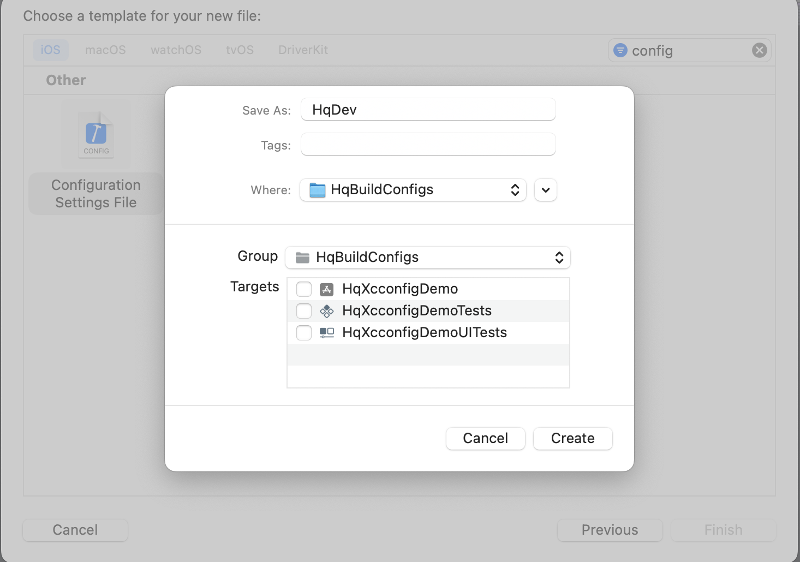
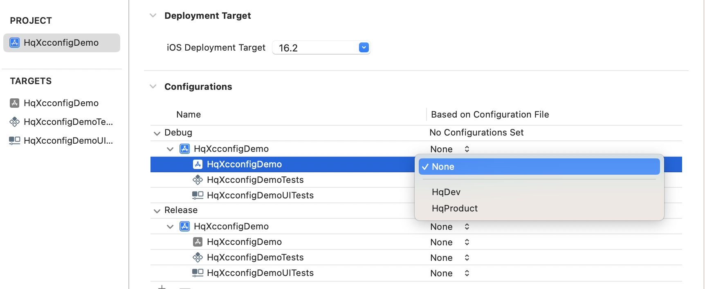
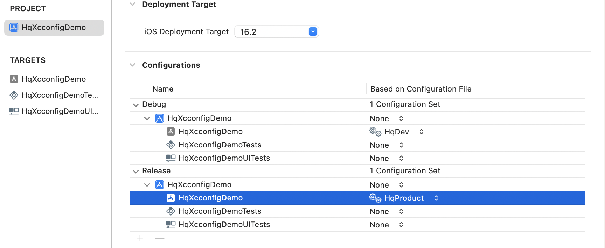
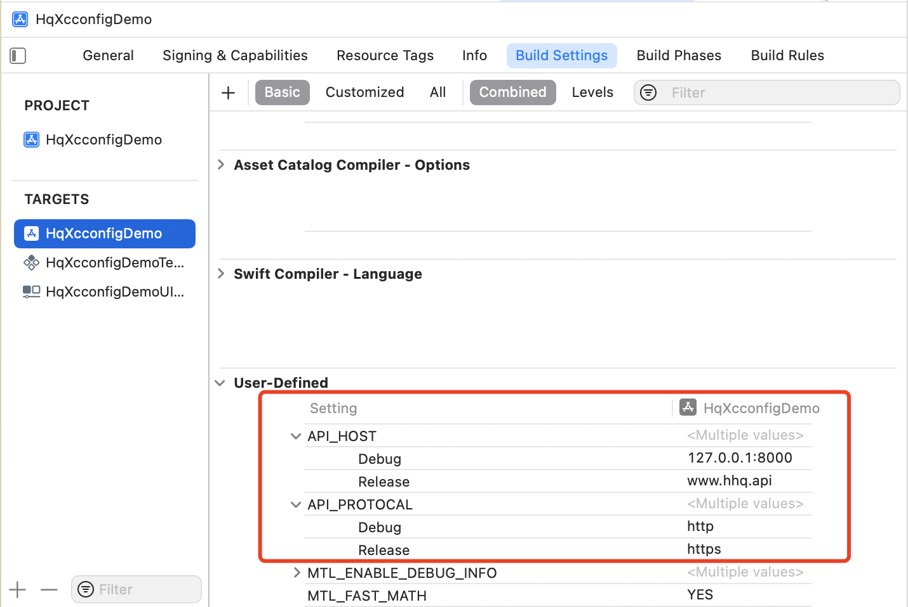
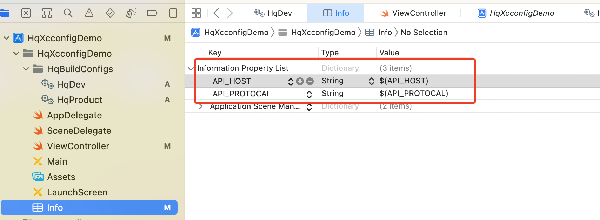
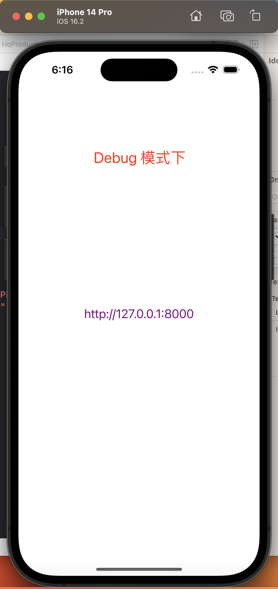

[toc]
# 给项目创建不同编译配置文件
## 创建 `Configuration Settings File (xcconfig)` 文件



## 在不同的`xcconfig`文件创建编译变量
通过上面的步骤创建`HqDev.xcconfig`和`HqProduct.xcconfig` 配置文件，其内容如下

`HqDev.xcconfig` 文件配置如下
```
APP_TARGET_TYPE = dev
API_PROTOCAL = http
API_HOST = 127.0.0.1:8000

```

`HqProduct.xcconfig` 文件配置如下
```
APP_TARGET_TYPE = dev
API_PROTOCAL = http
API_HOST = 127.0.0.1:8000

```


## 在`PROJECT`的`Configurations`对不同的target配置我们上面创建的`xcconfig`文件
通过选择  `PROJECT->info->Configurations` 分别为`Debug`和`Release`模式下不同的`target`选择我们刚才创建的配置文件


选择结果如下



## 查看配置的变量是否生效
通过选择 `TARGETS->HqxcconfigDemo->Build Settings->User-Defined`查看我们配置的结果如下图



## 在`info.pist`文件中使用配置的变量
在`info.plist`文件中使用我们定义的变量添加键值对,键值使用我们配置中定义变量的可以使用`$(var_name)`或`${var_name}`
如下图



## 在代码中读取`info.plist`配置的api信息
`ViewController`的代码如下：
```swift
class ViewController: UIViewController {
    
    lazy var apiInfoLab: UILabel = {
        let lab = UILabel.init()
        lab.font = UIFont.systemFont(ofSize: 20)
        lab.textColor = UIColor.purple
        lab.frame = self.view.frame
        lab.textAlignment = .center
        lab.numberOfLines = 0
        return lab
    }()
    
    func apiInfo() -> String {
        //获取info.plist配置的api信息
        let api_protocal = Bundle.main.infoDictionary?["API_PROTOCAL"] as? String ?? ""
        let api_host = Bundle.main.infoDictionary?["API_HOST"] as? String ?? ""
        print(api_protocal,api_host,target_type)
        return api_protocal + "://" + api_host
    }

    override func viewDidLoad() {
        super.viewDidLoad()
        self.view.addSubview(self.apiInfoLab)
        self.apiInfoLab.text = self.apiInfo()
    }
}

```

## 切换不同的模式查看结果
通过 `菜单栏->Product->Scheme->Edit Scheme->Run->Info->Configuration`选择`Debug`或`Release`来运行项目，结果如下图




